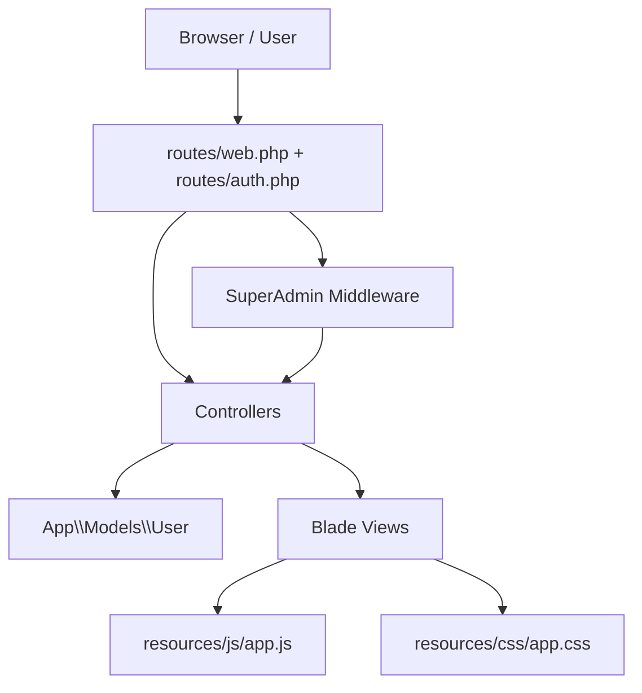
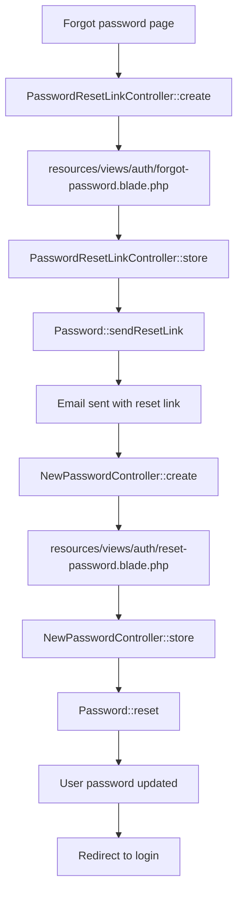
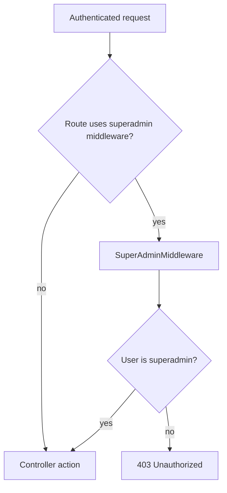
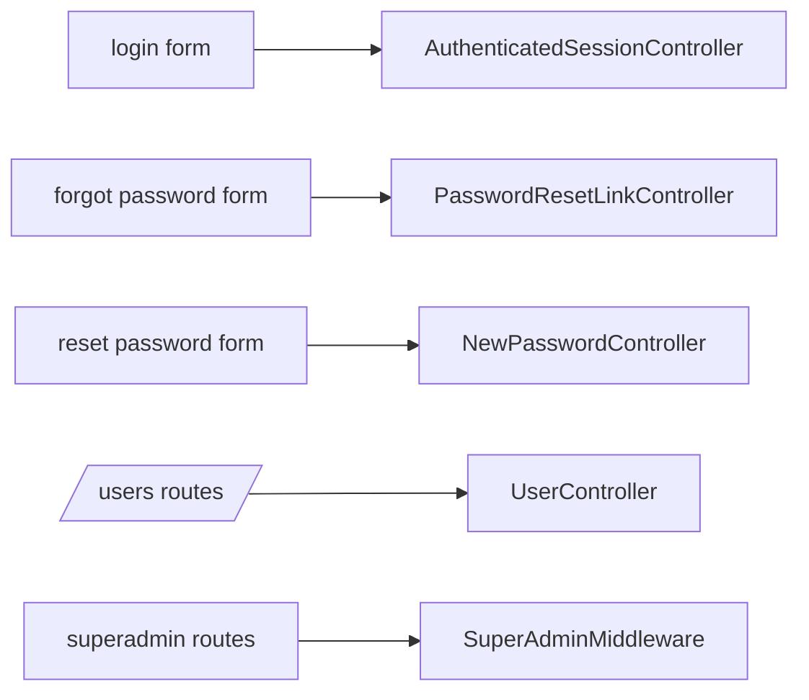

# Prabhu Insurance Project Flow

This document shows the main execution paths in the Laravel app and where each part calls into the next.

## 1) High-level architecture



## 2) Auth flow

```mermaid
flowchart TD
    A[Visit /login] --> B[AuthenticatedSessionController::create]
    B --> C[resources/views/auth/login.blade.php]
    C --> D[LoginRequest::authenticate]
    D --> E[AuthenticatedSessionController::store]
    E --> F[Auth::user()]
    F --> G[Update last_login on User model]
    G --> H[Redirect to dashboard]
```

### Call chain
- [`routes/auth.php`](routes/auth.php:14) maps `GET /login` to [`AuthenticatedSessionController::create()`](app/Http/Controllers/Auth/AuthenticatedSessionController.php:17).
- [`AuthenticatedSessionController::create()`](app/Http/Controllers/Auth/AuthenticatedSessionController.php:17) returns [`resources/views/auth/login.blade.php`](resources/views/auth/login.blade.php:1).
- Form submit goes to [`AuthenticatedSessionController::store()`](app/Http/Controllers/Auth/AuthenticatedSessionController.php:25).
- That calls [`LoginRequest::authenticate()`](app/Http/Requests/Auth/LoginRequest.php:41), then regenerates the session.
- After login, it updates `last_login` on [`App\\Models\\User`](app/Models/User.php:11).

## 3) Password reset flow



### Call chain
- [`routes/auth.php`](routes/auth.php:20) maps the forgot-password screen to [`PasswordResetLinkController::create()`](app/Http/Controllers/Auth/PasswordResetLinkController.php:17).
- Submit triggers [`PasswordResetLinkController::store()`](app/Http/Controllers/Auth/PasswordResetLinkController.php:27), which uses `Password::sendResetLink()`.
- The reset link opens [`NewPasswordController::create()`](app/Http/Controllers/Auth/NewPasswordController.php:22).
- Submit triggers [`NewPasswordController::store()`](app/Http/Controllers/Auth/NewPasswordController.php:32), which calls `Password::reset()` and saves the new hash on [`App\\Models\\User`](app/Models/User.php:11).
- Reset links expire after 5 minutes from [`config/auth.php`](config/auth.php:99).

## 4) Superadmin access flow



### Call chain
- [`bootstrap/app.php`](bootstrap/app.php:14) registers the `superadmin` middleware alias.
- [`routes/web.php`](routes/web.php:21) protects user management routes with `auth` + `superadmin`.
- [`routes/auth.php`](routes/auth.php:33) protects registration with `auth` + `superadmin`.
- [`SuperAdminMiddleware::handle()`](app/Http/Middleware/SuperAdminMiddleware.php:16) blocks non-superadmins.

## 5) User management flow

```mermaid
flowchart TD
    A[/users/] --> B[UserController::index]
    B --> C[User::orderBy(...)->get()]
    C --> D[resources/views/users/index.blade.php]

    E[/users/{user}/edit] --> F[UserController::edit]
    F --> G[resources/views/users/edit.blade.php]

    H[Edit form submit] --> I[UserController::update]
    I --> J[Validate request]
    J --> K[Hash password if present]
    K --> L[User::update]
    L --> M[Redirect with toast]

    N[Delete form submit] --> O[UserController::destroy]
    O --> P[Block self-deletion]
    P --> Q[Delete user]
    Q --> R[Redirect with toast]
```

### Call chain
- [`UserController::index()`](app/Http/Controllers/UserController.php:17) loads users and renders [`resources/views/users/index.blade.php`](resources/views/users/index.blade.php).
- [`UserController::edit()`](app/Http/Controllers/UserController.php:27) renders the edit form.
- [`UserController::update()`](app/Http/Controllers/UserController.php:35) validates input, updates the model, and sends a toast message.
- [`UserController::destroy()`](app/Http/Controllers/UserController.php:69) prevents self-delete, then deletes and redirects.

## 6) User model responsibilities

[`App\\Models\\User`](app/Models/User.php:11) acts as the central domain model for:
- custom primary key: `user_id`
- fillable attributes for `first_name`, `last_name`, `email`, `password`, `last_login`, `status`, `role`
- automatic password hashing through casts
- helper methods like [`User::isSuperAdmin()`](app/Models/User.php:73)
- helper methods like [`User::isUser()`](app/Models/User.php:81)
- query scopes [`scopeSuperAdmins()`](app/Models/User.php:89) and [`scopeUsers()`](app/Models/User.php:97)

## 7) UI layer

- [`resources/views/layouts/guest.blade.php`](resources/views/layouts/guest.blade.php:1) provides the branded auth shell.
- [`resources/views/auth/login.blade.php`](resources/views/auth/login.blade.php:1) handles sign-in UI.
- [`resources/views/auth/forgot-password.blade.php`](resources/views/auth/forgot-password.blade.php:1) handles reset-link requests.
- [`resources/views/auth/reset-password.blade.php`](resources/views/auth/reset-password.blade.php:1) handles password reset entry.
- [`resources/css/app.css`](resources/css/app.css:1) controls the auth layout and styling.
- [`resources/js/app.js`](resources/js/app.js:1) powers toast notifications and delete confirmation behavior.

## 8) Simplified request map



## 9) How to read the app

- Start at [`routes/web.php`](routes/web.php:1) and [`routes/auth.php`](routes/auth.php:1).
- Follow each route to its controller method.
- Controller methods either:
  - return a Blade view,
  - validate input,
  - call the [`User`](app/Models/User.php:11) model,
  - or apply middleware checks.
- Shared UI behavior is in [`resources/js/app.js`](resources/js/app.js:1) and [`resources/css/app.css`](resources/css/app.css:1).
